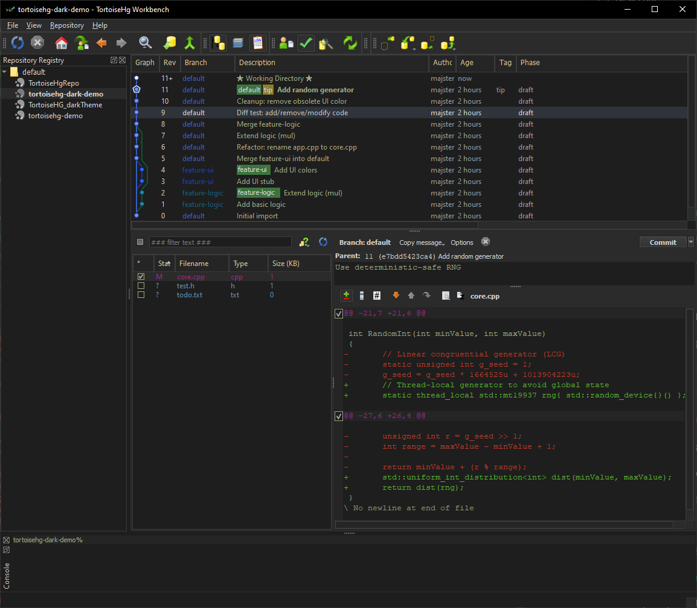
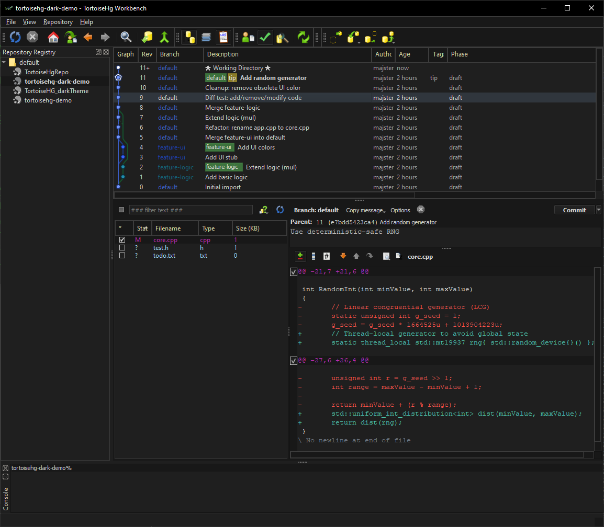
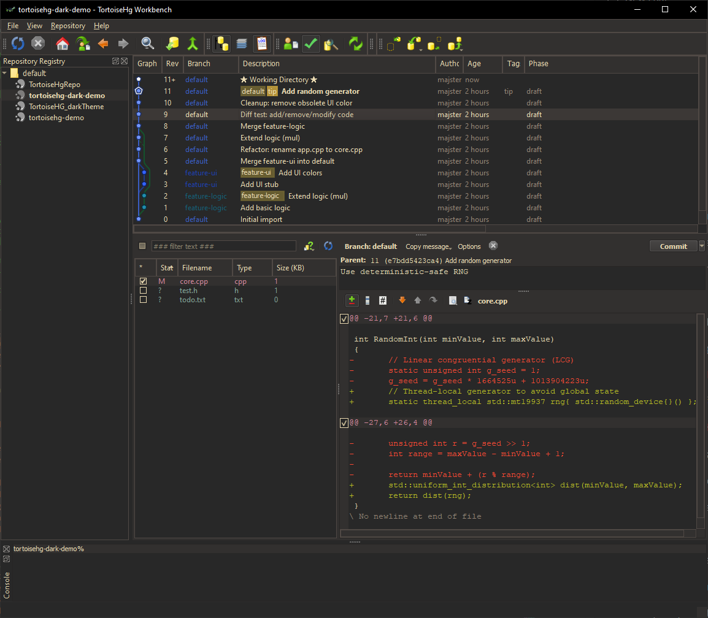
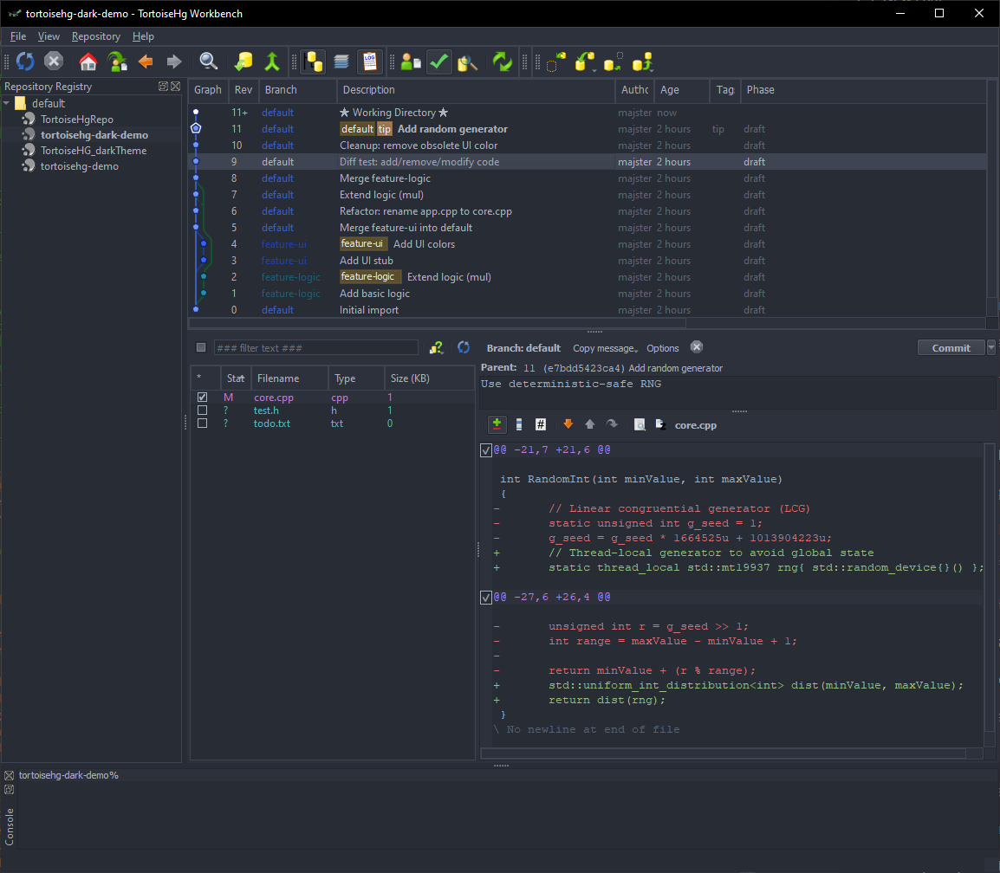
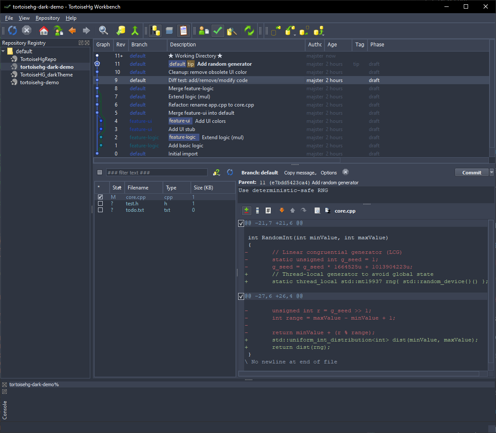

# TortoiseHg Dark Themes (Windows)

Dark theme support for TortoiseHg 7.0.1, including six built-in dark themes.

The project was developed and tested on **Windows 10**.  
The only Windows-specific feature is the **dark title bar**, which is applied
*only on Windows* and safely ignored on other platforms.

---

## Requirements

- **TortoiseHg 7.0.1** installed to: C:\Program Files\TortoiseHg
- **7-Zip** installed to: C:\Program Files\7-Zip  (required for automatic installation)

---

## Automatic Installation on Windows (Recommended)

1. Install **TortoiseHg 7.0.1** to: `C:\Program Files\TortoiseHg`
2. Install **7-Zip** to `C:\Program Files\7-Zip`
3. Download this repository and extract it to any directory (e.g. `C:\Projects\tortoisehg-dark-themes`)
4. Run the script: `tools\install_and_run_on_windows.bat` **as Administrator**

### What the script does

- Creates a **one-time backup** of the original: `C:\Program Files\TortoiseHg\lib\library.zip` to your repo folder
- Extracts the original library.zip into `repo\library`
- Adds 20 patched `.py` files (dark theme changes)
- Removes corresponding `.pyc` files
- Rebuilds `library.zip` using **7-Zip**
- Copies the new `library.zip` back into `C:\Program Files\TortoiseHg\lib\`
- Launches TortoiseHg

### If NOT run as Administrator

- No files are written to `Program Files`
- A patched `library.zip` is still created in the repository
- You need to manually copy the new `library.zip` back to: `C:\Program Files\TortoiseHg\lib`
- TortoiseHg is **not started automatically**

---

## Manual Installation on Windows

1. Copy the original file: `C:\Program Files\TortoiseHg\lib\library.zip`
   into the repository and **keep it as a backup**
2. Extract it into: `repo\library`
3. Apply patches: `tools\apply_patch.bat`
4. Repack `library.zip` using **7-Zip or WinRAR**
   (do NOT use `tar` or PowerShell `Compress-Archive`)
5. Copy the new `library.zip` back to: `C:\Program Files\TortoiseHg\lib`

---

## Theme Selection

After installation, select a theme in:

File / Settings / Workbench / Theme

An application restart is required after changing the theme.

---

## Custom Themes

Instructions for creating your own themes are available in the
`custom_themes` directory.

---

## License

This project follows the same license as TortoiseHg.  
See `COPYING.txt` for details.

---

## Additional Built-in Dark Themes

