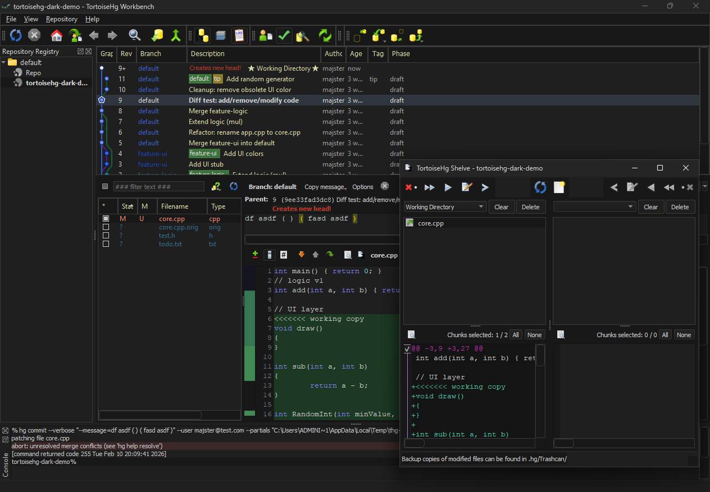
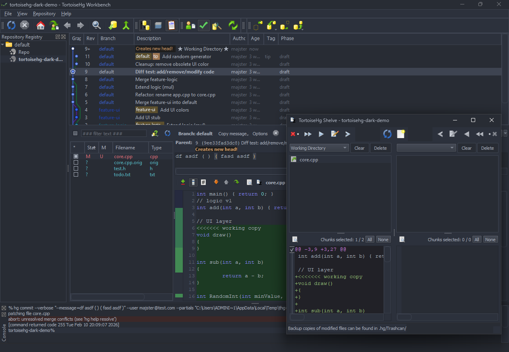
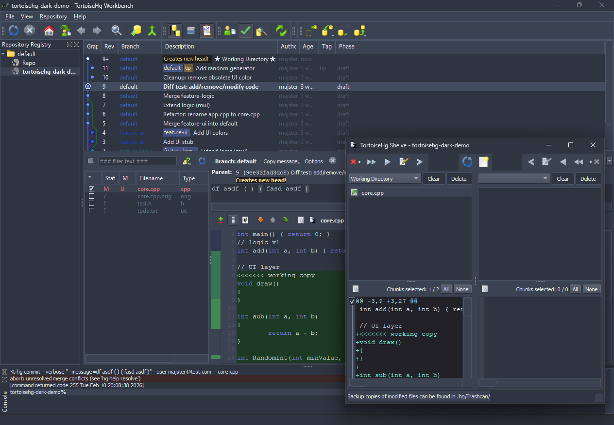
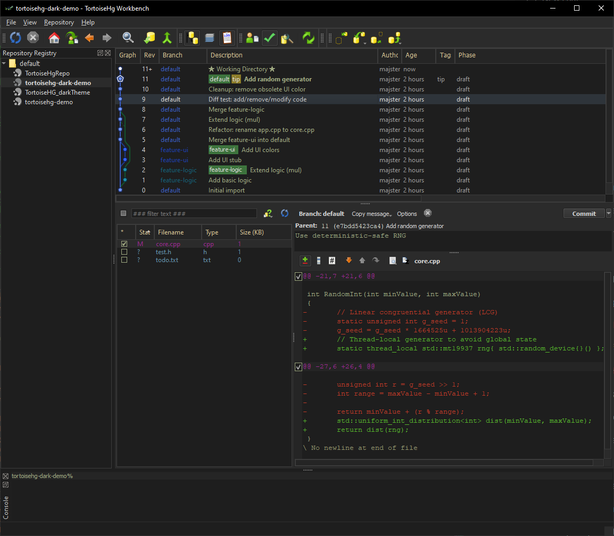

# TortoiseHg Dark Theme for Windows and Linux (version 7.0.1+)

This project adds a complete dark UI mode for the TortoiseHg Workbench. 

## Features

 - 6 built-in dark themes for TortoiseHg Workbench
 - quick installation on Windows
 - tested on Windows 10, Windows 11, and Ubuntu 22.04
 - works with PyQt5 and PyQt6
 - custom theme support

### Dark Theme for TortoiseHg Workbench

## Installation on Linux

See the [Linux installation guide for TortoiseHg dark themes](linux/README.md).

## Installation on Windows (Recommended)

1. Install **[TortoiseHg 7.0.1](https://tortoisehg.bitbucket.io)** and **[7-Zip](https://7-zip.org)** to their default locations
2. Download this repository as a zip and extract it to a path without spaces (e.g. `C:\Projects\tortoisehg-dark-themes`)
3. Run `tools\install_and_run_on_windows.bat` **as Administrator**
4. Select a theme in: **File / Settings / Workbench / Theme** (restart required)

> Without Administrator rights, the patched `library.zip` is created in the repo but not copied automatically. Copy it manually to `C:\Program Files\TortoiseHg\lib\`.

---

## Manual Installation on Windows

1. Backup `C:\Program Files\TortoiseHg\lib\library.zip` to the repo folder
2. Extract it into `repo\library`
3. Run `tools\apply_patch.bat`
4. Repack `library.zip` using **7-Zip** or **WinRAR** (not `tar` or `Compress-Archive`)
5. Copy the new `library.zip` back to `C:\Program Files\TortoiseHg\lib\`

---

## Custom Themes

See the [custom TortoiseHg theme guide](custom_themes/README.md) to create your own themes.

---

## Screenshots

### Midnight Theme

### Gruvbox Theme

### Cobalt Theme

### Graphite Theme

### Nord Theme

## Known limitations
- On Windows 10, the window title bar remains black and cannot be recolored due to OS limitations.

---

Screenshot from Windows 10
