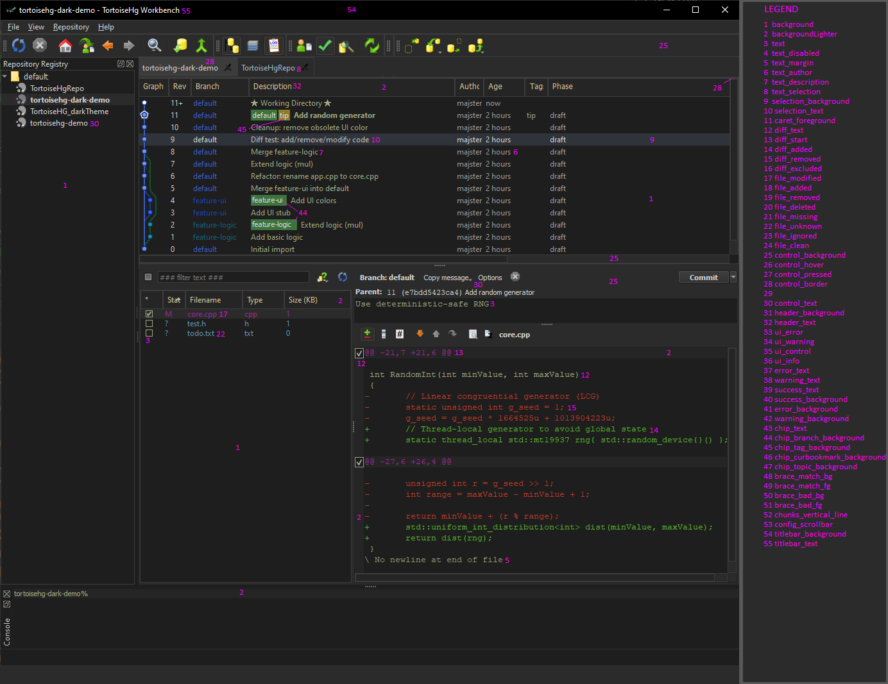

# Custom Themes

This mod adds support for **custom themes** and **overrides of built-in themes**
to TortoiseHg via `mercurial.ini`.

Application restart is required.

Supported color formats: `#RRGGBB`, `rgb(r, g, b)`  
Invalid values are ignored safely.

---

## Custom Theme

Create a new theme by adding a section to `mercurial.ini`:

```ini
[theme.mytheme]
background = #1e1e1e
text = #d4d4d4
diff_added = #58b62d
diff_removed = #c23a28
```

Only the colors you specify are overridden.
All missing values are inherited from the built-in dark theme.
Colors can also be defined using the rgb(r, g, b) format:

```ini
[theme.mytheme]
background = rgb(30, 30, 30)
text = rgb(212, 212, 212)
diff_added = rgb(88, 182, 45)
diff_removed = rgb(194, 58, 40)
```

This example overrides the built-in dark theme:

```ini
[theme.dark]
selection_background = rgb(73, 71, 43)
control_text = rgb(163, 187, 201)
```

---

## Built-in Theme Reference

`builtin_themes.txt` is a helper file that contains colors in `rgb()` format
instead of hex codes. It provides ready-to-copy theme sections for
`mercurial.ini`.

Built-in themes are implemented in `theme.py` (internal, not user-editable).

---

## Theme Color Key Reference

The following screenshot shows a visual mapping between UI elements
and their corresponding theme color keys.

Each highlighted element is marked with a number.  
The legend on the right lists the matching theme key for each number.

This makes it easy to identify which key to override in `mercurial.ini`
without guessing or trial and error.

