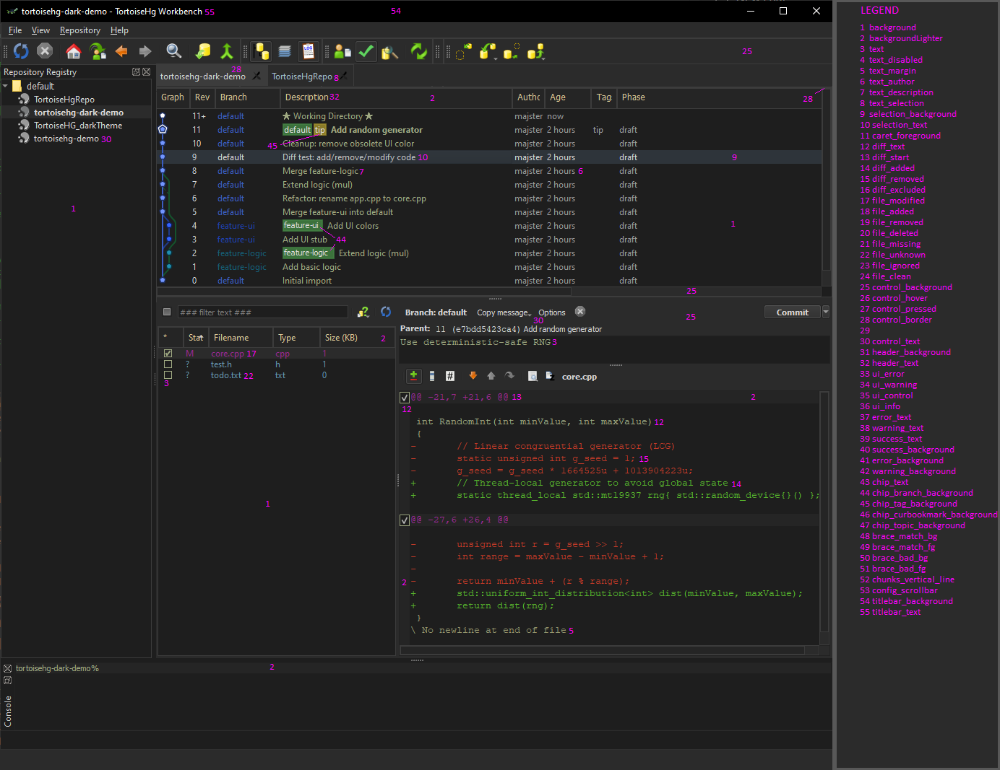

# Custom Themes

Create your own themes by adding a section to `hgrc or mercurial.ini`.
Supported color formats: `#RRGGBB`, `rgb(r, g, b)`. Restart required.

```ini
[theme.dark_purple]
background = #1A1423
backgroundLighter = #221A2E
text = #BCA9D6
text_disabled = #6F6780
text_margin = #7E6F99
text_author = #8C7BAA
text_description = #BCA9D6
selection_background = #2E2040
control_background = #221A2E
control_border = #3A2C4D
```

Only specified colors are overridden - missing values inherit from the built-in dark theme.
You can also override built-in themes directly:

```ini
[theme.dark]
selection_background = rgb(73, 71, 43)
control_text = rgb(163, 187, 201)
```

---

## Reference

- `builtin_themes.txt` contains ready-to-copy theme sections for `hgrc/mercurial.ini`
- Color key mapping of UI elements to theme keys:

