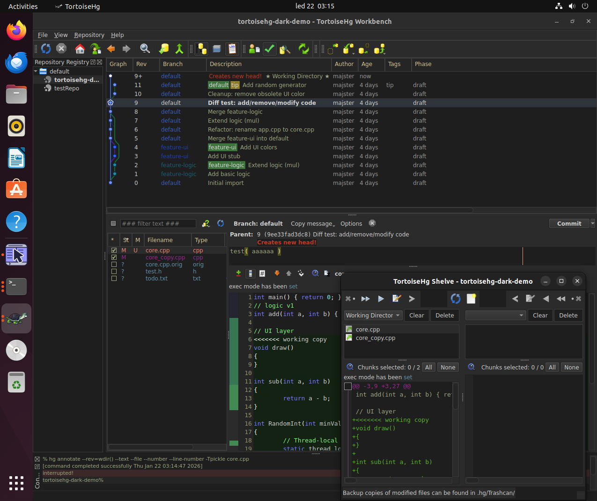
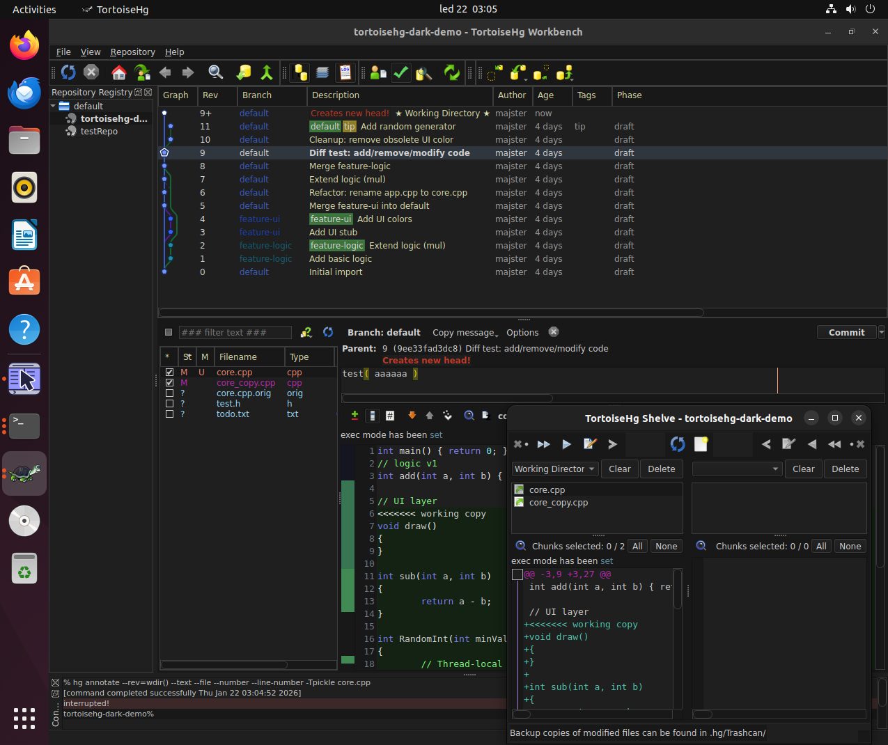
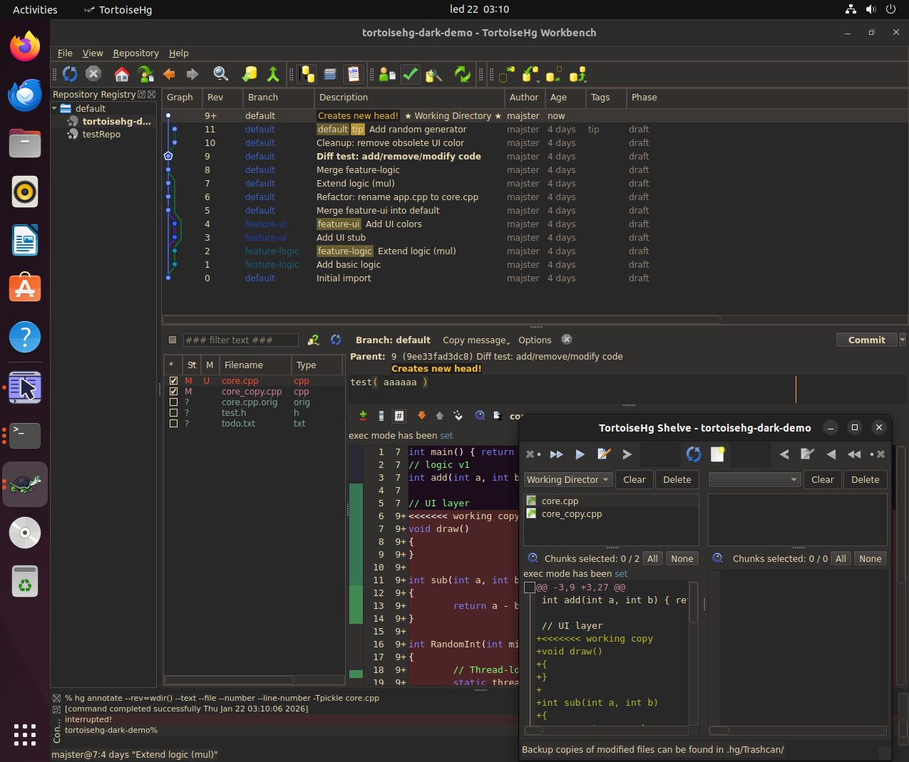
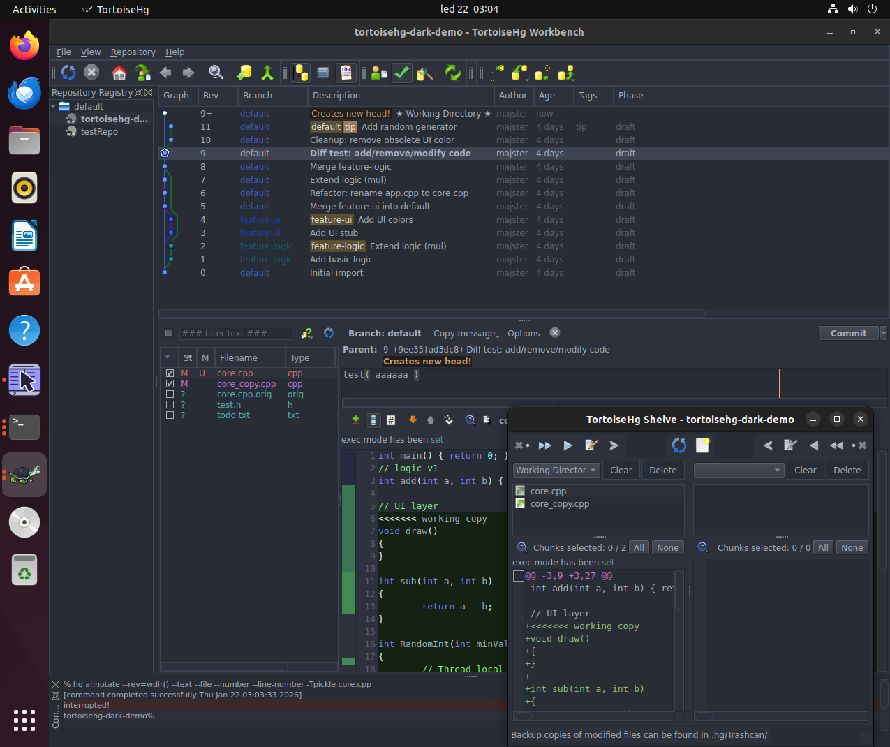

# Linux Installation

This page is part of the **TortoiseHg Dark Themes** project and describes how to install the dark theme on Linux.



The setup:
- uses a **Python virtual environment (venv)**
- does **not modify system files**

---

## Why a virtual environment?

Using a Python virtual environment ensures:
- isolated Python dependencies
- no conflicts with system Python
- allows using a newer Mercurial version than provided by Ubuntu LTS
- predictable behavior across distributions
- easier debugging and maintenance

---

## Requirements

### Ubuntu 22.04 (tested)

Other Debian-based distributions should work with equivalent packages.

```bash
sudo apt update
sudo apt install -y \
    python3 python3-venv python3-pip \
    python3-pyqt5 python3-pyqt5.qsci \
    wget unzip
```

(Fedora users: install the equivalent python3-qt5* packages.)

#### 1. Download and install TortoiseHg 7.0.1 into a venv
```bash
# ------------------------------------------------------------
# 1) Download OFFICIAL TortoiseHg 7.0.1 source tarball
# ------------------------------------------------------------
mkdir -p ~/apps
cd ~/apps

wget https://www.mercurial-scm.org/release/tortoisehg/targz/tortoisehg-7.0.1.tar.gz
tar -xvf tortoisehg-7.0.1.tar.gz
cd tortoisehg-7.0.1

# ------------------------------------------------------------
# 2) Create Python virtual environment
#    IMPORTANT: allow access to system PyQt5
# ------------------------------------------------------------
python3 -m venv venv --system-site-packages
source venv/bin/activate

# ------------------------------------------------------------
# 3) Python dependencies inside venv
# ------------------------------------------------------------
pip install --upgrade pip

# required at build-time
pip install wheel mercurial iniparse

# ------------------------------------------------------------
# 4) Install TortoiseHg
# ------------------------------------------------------------
pip install . --no-build-isolation
```
#### 2. Download the dark theme (ZIP)
```bash
cd ~/apps

wget https://github.com/majster64/tortoisehg-dark-themes/archive/refs/heads/main.zip
unzip main.zip
```

This creates:

`~/apps/tortoisehg-dark-themes-main/`

#### 3. Install the dark theme

```bash
cp -r tortoisehg-dark-themes-main/tortoisehg/hgqt/* \
      ~/apps/tortoisehg-7.0.1/tortoisehg/hgqt/
```

#### 4. Create automatic launcher run-thg-venv.sh

```bash
cat > ~/apps/tortoisehg-7.0.1/run-thg-venv.sh << 'EOF'
#!/usr/bin/env bash
set -euo pipefail

DIR="$(cd "$(dirname "$0")" && pwd)"

export QT_STYLE_OVERRIDE=Fusion
export QT_QPA_PLATFORMTHEME=
export PYTHONPATH="$DIR"

# IMPORTANT: use Mercurial from venv, not system
export PATH="$DIR/venv/bin:$PATH"

exec "$DIR/venv/bin/thg" "$@"
EOF

chmod +x ~/apps/tortoisehg-7.0.1/run-thg-venv.sh
```

#### 5. Create a desktop shortcut

```bash
cat > ~/Desktop/TortoiseHg-Dark.desktop << EOF
[Desktop Entry]
Name=TortoiseHg (Dark)
Comment=TortoiseHg 7.0.1 with dark theme
Exec=/home/$USER/apps/tortoisehg-7.0.1/run-thg-venv.sh
Icon=tortoisehg
Type=Application
Categories=Development;RevisionControl;
Terminal=false
EOF

chmod +x ~/Desktop/TortoiseHg-Dark.desktop
gio set ~/Desktop/TortoiseHg-Dark.desktop metadata::trusted true
```

## Running TortoiseHg

    Double-click TortoiseHg (Dark) on the Desktop
    or

    Run from terminal:

`~/apps/tortoisehg-7.0.1/run-thg-venv.sh`

## Enable the dark theme

Inside TortoiseHg:

    File / Settings / Workbench / Theme

    Select theme: dark

    Restart TortoiseHg

## Known limitations

- This setup does not integrate TortoiseHg into the system file manager
  (Nautilus / Dolphin context menus).
- The system-installed TortoiseHg (if present) is not modified.

## Uninstall

Simply remove the installation directory:

```bash
rm -rf ~/apps/tortoisehg-7.0.1
```

## Additional Screenshots



